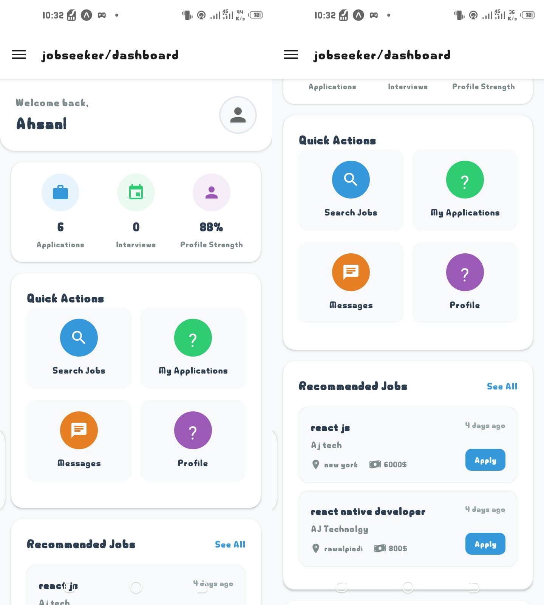
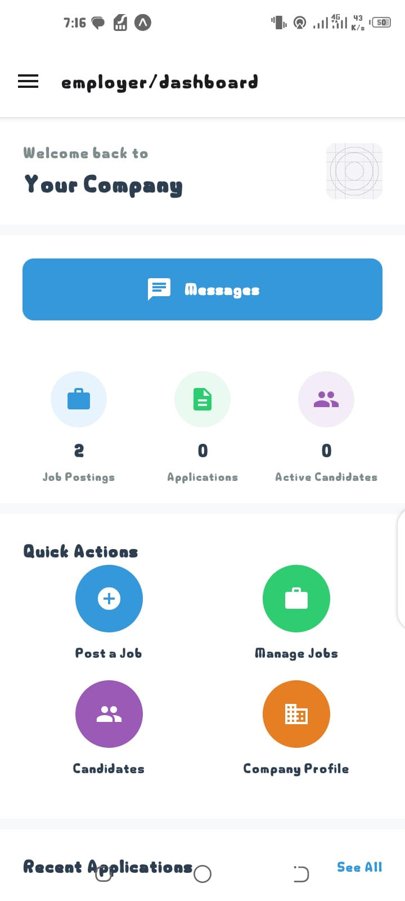
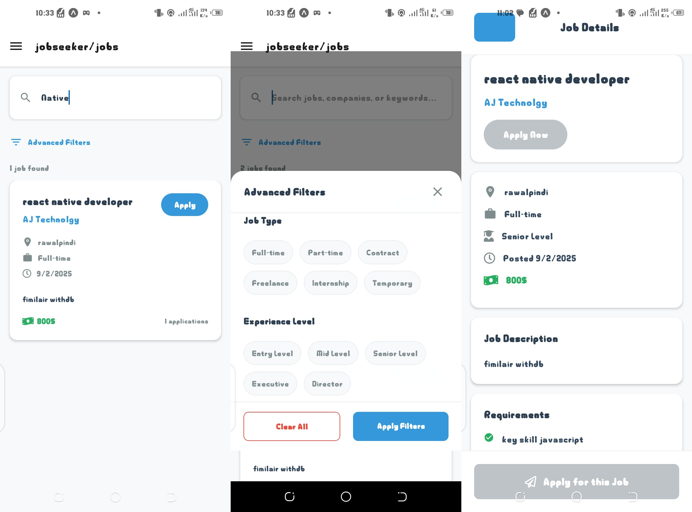
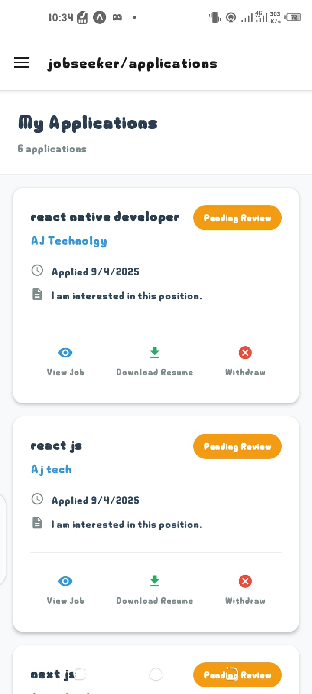
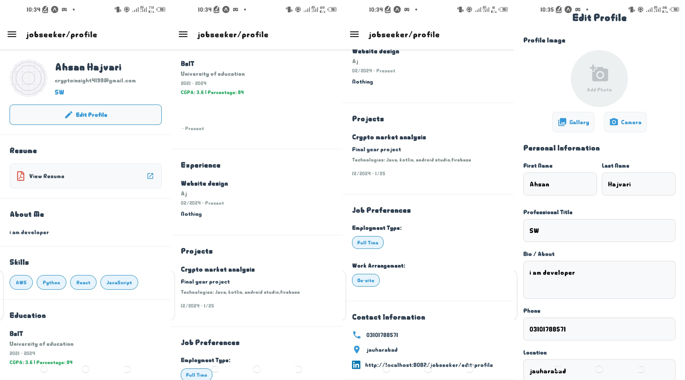
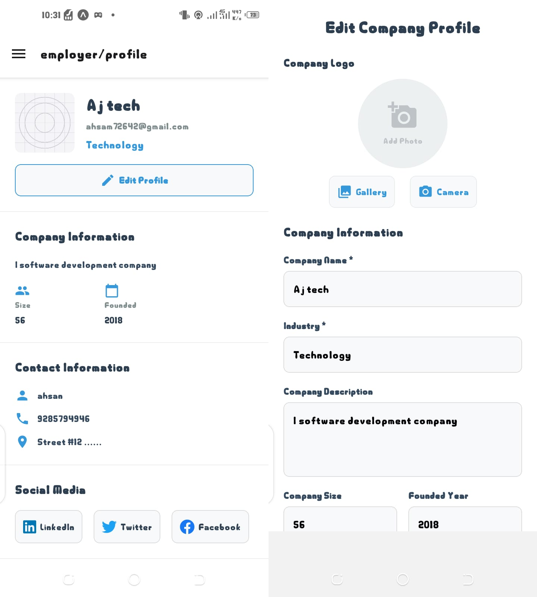
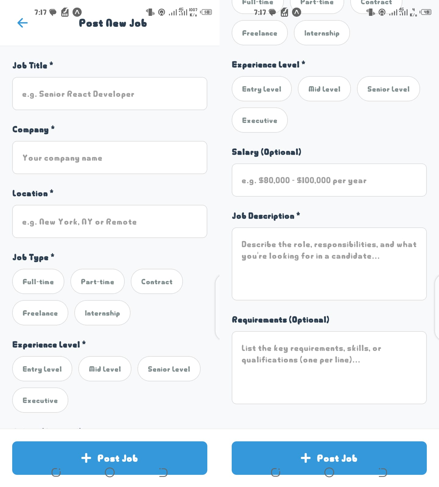
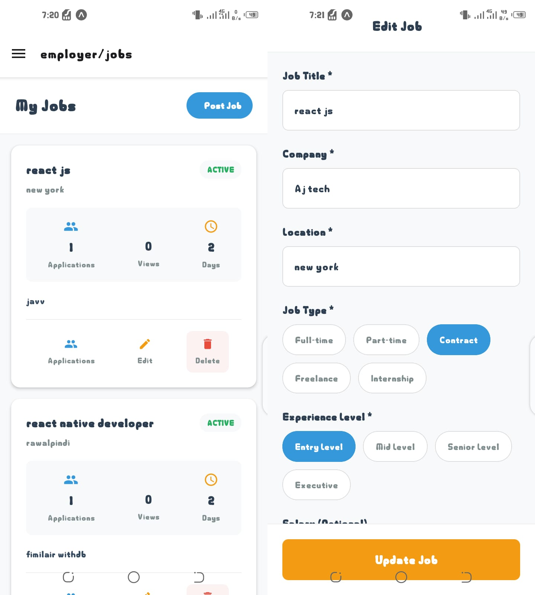
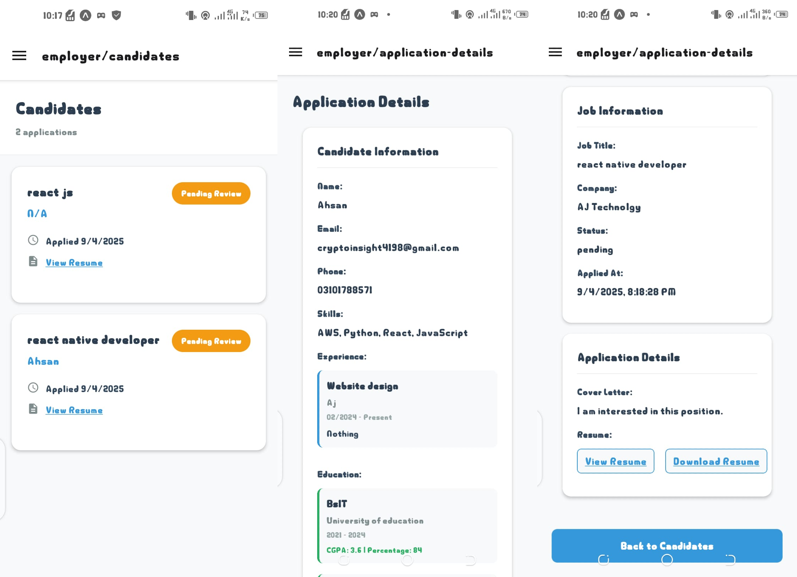

# JobConnect - Job Portal Mobile App

A comprehensive job portal mobile application built with React Native and Expo, designed to connect job seekers with employers through an intuitive and feature-rich platform.  

## 🚀 Features
- **real-time messaging between employers and job seekers**
### For Job Seekers
- **User Registration & Authentication**: Secure signup and login with email verification  
- **Profile Management**: Complete profile setup with skills, experience, and resume upload  
- **Job Search & Filtering**: Advanced search with filters by location, salary, job type, and industry  
- **Job Applications**: Easy application process with resume submission  
- **Application Tracking**: Monitor application status and history  
- **Community Posts**: Engage with the job community through posts and discussions (🔄 *in progress*)  

### For Employers
- **Company Profile**: Complete company information and branding  
- **Job Posting**: Create and manage job listings with detailed requirements  
- **Candidate Management**: View and manage job applications  
- **Analytics Dashboard**: Track job performance and application metrics  
- **Application Review**: Detailed candidate profiles and application management  
- **Direct Messaging**: Communicate with job seekers directly (🔄 *in progress*)  

## 🛠️ Technology Stack

- **Frontend**: React Native with Expo  
- **Navigation**: Expo Router for file-based routing  
- **Authentication**: Firebase Authentication  
- **Database**: Firebase Firestore  
- **Storage**: Firebase Storage for file uploads  
- **State Management**: React Context API  
- **UI Components**: React Native built-in components with custom styling  
- **Icons**: Expo Vector Icons (Material Icons, Ionicons)  

## 📱 Screenshots

### Login & Authentication


### Job Seeker Features

#### Dashboard



#### Job Search & Applications



#### Profile Management



### Employer Features

#### Job Management



#### Candidate Management


## 🔧 Installation & Setup

### Prerequisites
- Node.js (v16 or higher)  
- npm or yarn  
- Expo CLI  
- Firebase project with Authentication, Firestore, and Storage enabled  

### Installation Steps

1. **Clone the repository**
   ```bash
   git clone https://github.com/yourusername/jobconnect-mobile.git
   cd jobconnect-mobile
   ```

2. **Install dependencies**
   ```bash
   npm install
   ```

3. **Configure Firebase**
   - Create a Firebase project at [Firebase Console](https://console.firebase.google.com/)  
   - Enable Authentication, Firestore, and Storage  
   - Copy your Firebase config to `src/config/firebase.js`  

4. **Start the development server**
   ```bash
   npx expo start
   ```

5. **Run on device/emulator**
   - For iOS: Press `i` in the terminal  
   - For Android: Press `a` in the terminal  
   - For web: Press `w` in the terminal  

## 📁 Project Structure

```
jobconnect-mobile/
├── app/                          # Main application screens
│   ├── (auth)/                   # Authentication screens
│   │   ├── login.js
│   │   ├── register.js
│   │   └── verify-email.js
│   ├── (main)/                   # Main app screens
│   │   ├── employer/             # Employer-specific screens
│   │   ├── jobseeker/            # Job seeker screens
│   │   ├── analytics.js
│   │   ├── hybrid-layout.js      # Main navigation layout
│   │   └── settings.js
│   └── _layout.tsx               # Root layout
├── src/
│   ├── components/               # Reusable UI components
│   ├── contexts/                 # React contexts
│   ├── services/                 # API and service functions
│   ├── utils/                    # Utility functions
│   └── config/                   # Configuration files
├── assets/                       # Images and static assets
└── package.json
```

## 🔐 Firebase Configuration

Create a `.env` file in the root directory with your Firebase configuration:

```javascript
// src/config/firebase.js
import { initializeApp } from 'firebase/app';
import { getAuth } from 'firebase/auth';
import { getFirestore } from 'firebase/firestore';
import { getStorage } from 'firebase/storage';

const firebaseConfig = {
  apiKey: "your-api-key",
  authDomain: "your-project.firebaseapp.com",
  projectId: "your-project-id",
  storageBucket: "your-project.appspot.com",
  messagingSenderId: "123456789",
  appId: "your-app-id"
};

const app = initializeApp(firebaseConfig);
export const auth = getAuth(app);
export const db = getFirestore(app);
export const storage = getStorage(app);
```

## 🧭 Future Work

We plan to extend JobConnect with:  
- 🤖 **AI Career Consultant**: Smart recommendations for job seekers based on skills and experience  
- 📊 **Resume Analyzer**: AI-powered feedback on uploaded resumes  
- 🔔 **Push Notifications**: Real-time alerts for job postings, messages, and updates  
- 🌐 **Multilingual Support**: Accessibility for users across different regions  


**Made with ❤️ using React Native & Expo**  
